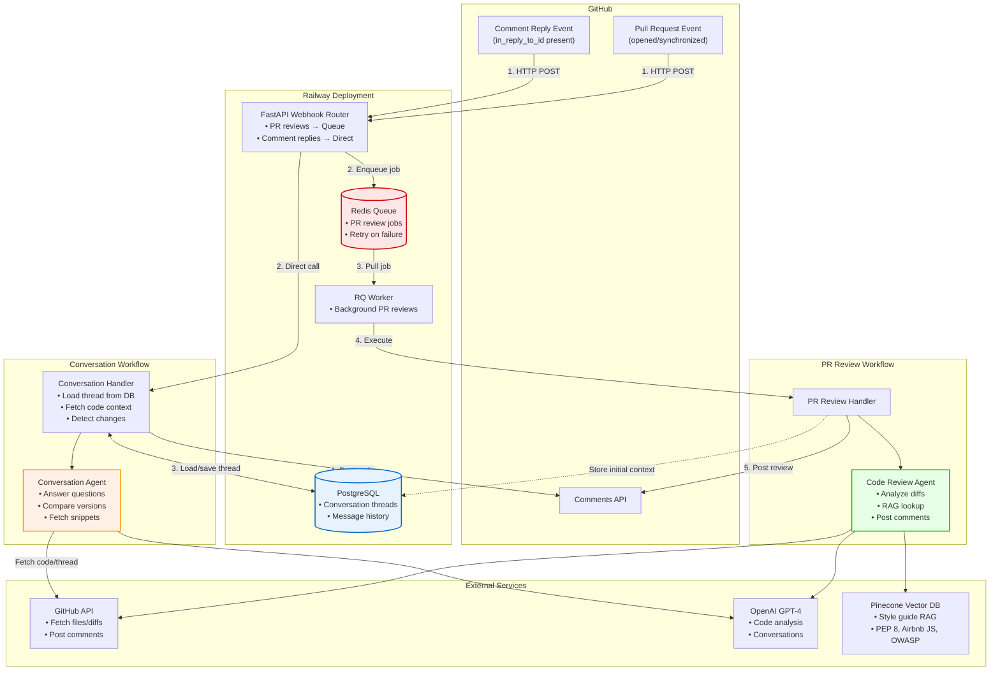

# AI Code Review Agent

Automated GitHub PR code review using Pydantic AI and OpenAI with multi-turn conversation support.

## Features

- **Automated PR Code Review**: AI-powered analysis of pull request changes with inline comments
- **Multi-turn Conversations**: Developers can reply to bot comments and get contextual responses
- **RAG-Powered Recommendations**: Style guide citations from PEP 8, Airbnb JS, OWASP using Pinecone
- **Code Context Awareness**: Bot tracks conversation history and code changes between commits
- **Severity Classification**: Comments categorized as critical, warning, or suggestion
- **Efficient Queue System**: Background processing with Redis and RQ for reliable webhook handling
- **FastAPI Webhook Server**: Handles GitHub events for PRs and review comment threads

## Development Setup

### Prerequisites

- Python 3.10+
- GitHub App credentials
- OpenAI API key
- Pinecone API key (optional, for RAG features)

### Installation

```bash
# Clone the repository
git clone https://github.com/your-org/AI-Code-Reviewer.git
cd AI-Code-Reviewer

# Install dependencies
pip install -e ".[dev]"
```

### Pre-commit Hooks

This project uses pre-commit hooks to ensure code quality before commits.

**Install and setup:**

```bash
# Install pre-commit
pip install pre-commit

# Install git hooks
pre-commit install

# Generate secrets baseline (first time only)
detect-secrets scan > .secrets.baseline

# Run hooks manually on all files
pre-commit run --all-files
```

**Configured hooks:**
- **ruff** - Fast Python linting and formatting
- **detect-secrets** - Secrets scanning
- **bandit** - Security vulnerability checking
- **pre-commit-hooks** - Trailing whitespace, EOF, large files, private keys

**Note:** Type checking with mypy runs separately (not in pre-commit) for speed. Run manually with `mypy src/`

**Skip hooks for quick commits:**
```bash
# Skip all hooks
git commit -m "message" --no-verify
```

### Running Tests

```bash
# Run all tests with coverage
pytest --cov=src --cov-report=term-missing --cov-report=html

# Run specific test file
pytest tests/unit/test_agents/test_code_reviewer.py -v

# Run tests in parallel
pytest -n auto
```

### Code Quality Checks

```bash
# Format code
black .

# Lint and auto-fix
ruff check --fix .

# Type check
mypy src/

# Security scan
bandit -r src/
```

## Configuration

Set environment variables in `.env.local` (see `.env.example`):

```bash
# Required
OPENAI_API_KEY=sk-...
GITHUB_TOKEN=ghp_...  # Or use GitHub App credentials
GITHUB_WEBHOOK_SECRET=your-secret

# Optional - GitHub App
GITHUB_APP_ID=123456
GITHUB_APP_INSTALLATION_ID=987654
GITHUB_APP_PRIVATE_KEY_PATH=/path/to/key.pem

# Optional - RAG features
PINECONE_API_KEY=pc-...
PINECONE_INDEX_NAME=code-style-guides
```

## Architecture

The system follows a layered architecture with two main workflows:

### System Diagram



### Component Overview

**Agents:**
- `src/agents/code_reviewer.py` - PR review agent with GitHub and RAG tools
- `src/agents/conversation_agent.py` - Multi-turn conversation agent with code context tools

**Handlers:**
- `src/api/handlers/pr_review_handler.py` - Processes new PR reviews (queued)
- `src/api/handlers/conversation_handler.py` - Processes comment replies (synchronous)

**Tools:**
- `src/tools/github_tools.py` - GitHub API operations (fetch files, diffs, post comments)
- `src/tools/rag_tools.py` - Pinecone vector search for style guides
- `src/tools/conversation_tools.py` - Code snippet fetching, version comparison, thread retrieval

**Services:**
- `src/services/github_auth.py` - GitHub App JWT authentication
- `src/services/rag_service.py` - Pinecone integration and document indexing

**Database:**
- `src/models/conversation.py` - ConversationThread model for tracking multi-turn discussions
- `src/database/db.py` - SQLAlchemy session management

**API:**
- `src/api/webhooks.py` - FastAPI webhook router for GitHub events
- `src/queue/config.py` - Redis and RQ configuration for background jobs

## Deployment

See [DEPLOYMENT.md](DEPLOYMENT.md) for deployment instructions.

## Contributing

1. Create a feature branch
2. Make your changes
3. Run tests and quality checks
4. Submit a pull request

Pre-commit hooks will run automatically on commit. All checks must pass before merging.

## License

MIT
