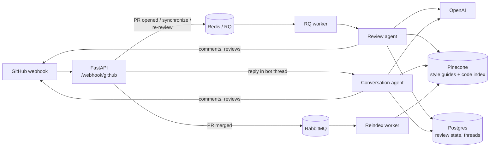

# AI Code Reviewer

A self-hosted GitHub App that reviews pull requests with an LLM, grounded in real style guides and in your own codebase.

[](https://github.com/Osireg17/AI-Code-Reviewer/actions/workflows/test.yml)
[](https://github.com/Osireg17/AI-Code-Reviewer/actions/workflows/lint.yml)


## What it does

When a pull request is opened or updated, the bot reads the diff, checks how the changed code is used elsewhere in the repo, looks up relevant style-guide guidance, and posts a review:

- **Inline comments** on the changed lines, focused on correctness, security, design and tests — not linter nits.
- **One-click fixes** as GitHub `suggestion` blocks the author can commit straight from the PR.
- **A formal review verdict** (Approve / Request changes / Comment), so the bot appears under *Reviewers*.
- **Incremental re-reviews** — on new pushes it only reviews what changed since its last review, and falls back to a full review after a force-push.
- **Threaded conversations** — reply to any bot comment and it answers in the thread, aware of whether the code has changed since.
- **On-demand re-review** — comment `/ai-review` (or `@<bot> re-review`) on the PR.

Example inline comment:

> `get_user()` can return `None` here, but `user.email` is read unconditionally on the next line — a deleted account will raise `AttributeError` and fail the whole request.
>
> ```suggestion
> if user is None:
>     raise NotFound(user_id)
> send_welcome(user.email)
> ```

## How it works


```mermaid
flowchart LR
    GH[GitHub webhook] --> API[FastAPI<br/>/webhook/github]
    API -->|PR opened / synchronize /<br/>re-review| Q[(Redis / RQ)]
    Q --> W[RQ worker] --> RA[Review agent]
    API -->|reply in bot thread| CA[Conversation agent]
    API -->|PR merged| MQ[(RabbitMQ)] --> RW[Reindex worker]
    RA & CA --> LLM[OpenAI]
    RA & CA --> PC[(Pinecone<br/>style guides + code index)]
    RA & CA --> DB[(Postgres<br/>review state, threads)]
    RA & CA -->|comments, reviews| GH
    RW --> PC
```

- **Review agent** (`src/agents/code_reviewer.py`) — a Pydantic AI agent with tools to fetch the PR, list and filter changed files, read diffs and full files, search the codebase, search style guides, format fixes, and post comments. Its instructions live in `src/prompts/code_reviewer_prompt.py`.
- **Conversation agent** (`src/agents/conversation_agent.py`) — answers replies in threads the bot started. History is stored per thread in Postgres.
- **Style-guide RAG** — PEP 8, Google/Airbnb style guides, Effective Go/Java, OWASP and others, chunked into Pinecone with one namespace per language.
- **Codebase index** — tree-sitter extracts every function's signature and the functions it calls (Python, JS/TS, Go, Java) into Pinecone, one namespace per repo. The agent uses it for "how is this done elsewhere?" (`semantic`) and "who calls this?" (`exact_call`).
- **Postgres** stores the last reviewed commit per PR (for incremental reviews) and conversation threads. Tables are created on startup.

## GitHub App setup

Create a GitHub App ([docs](https://docs.github.com/en/apps/creating-github-apps/registering-a-github-app/registering-a-github-app)) with:

| Permission | Access | Why |
| --- | --- | --- |
| Pull requests | Read & write | Read diffs, post review comments and reviews |
| Contents | Read | Read full files and the repo tree for indexing |
| Issues | Read & write | Read re-review commands, post summary comments |
| Metadata | Read | Required by GitHub |

| Event | Used for |
| --- | --- |
| Pull request | Review on open/reopen/push; reindex on merge |
| Pull request review comment | Replies in bot threads |
| Issue comment | `/ai-review` re-review trigger |

Set the webhook URL to `https://<your-host>/webhook/github` and choose a webhook secret. Generate a private key, install the app on your repo, and note the App ID and Installation ID.

> The app currently serves **one installation** — the one set in `APP_INSTALLATION_ID`.

## Quickstart (local)

Requires Python 3.11+, Postgres, Redis, and an OpenAI key. Pinecone and RabbitMQ are optional.

```bash
git clone https://github.com/Osireg17/AI-Code-Reviewer.git
cd AI-Code-Reviewer
python -m venv .venv && source .venv/bin/activate
pip install -e ".[dev]"
cp .env.example .env.local   # then edit — see Configuration below

# terminal 1: API
uvicorn src.main:app --reload --port 8000
# terminal 2: review worker
python worker.py
# terminal 3: expose the webhook
ngrok http 8000
```

Check it's up at `http://localhost:8000/health`, then open a PR on the installed repo.

## Configuration

Settings are read from the environment and `.env.local`. The source of truth is [`src/config/settings.py`](src/config/settings.py).

> **Use the names below exactly.** `GITHUB_APP_ID`, `GITHUB_WEBHOOK_SECRET` and other `GITHUB_*` spellings are **not** read (GitHub Actions reserves that prefix).

| Variable | Required | Default | Purpose |
| --- | --- | --- | --- |
| `OPENAI_API_KEY` | ✅ | — | LLM and embeddings |
| `OPENAI_MODEL` | | `gpt-5.6-luna` | Model for both agents (OpenAI Responses API) |
| `APP_ID` | ✅ | — | GitHub App ID |
| `APP_INSTALLATION_ID` | ✅ | — | Installation to act as |
| `APP_PRIVATE_KEY_PATH` / `APP_PRIVATE_KEY` | ✅ one | — | Path to the `.pem`, or its contents (use the latter on Railway) |
| `WEBHOOK_SECRET` | ✅ | — | Verifies webhook signatures |
| `GITHUB_APP_BOT_LOGIN` | | `searchlightai[bot]` | Your app's bot login — used to ignore its own comments and build re-review phrases |
| `DATABASE_URL` | ✅ | local Postgres | Use the `postgresql+psycopg2://` scheme (see below) |
| `REDIS_URL` | ✅* | — | Or `REDIS_HOST` / `REDIS_PORT` / `REDIS_PASSWORD` |
| `PINECONE_API_KEY` | | — | Enables style-guide and codebase search |
| `PINECONE_INDEX_NAME` | | `code-style-guides` | Style-guide index |
| `PINECONE_CODEBASE_INDEX_NAME` | | `codebase-index` | Codebase index |
| `RAG_ENABLED` | | `True` | Toggle style-guide search |
| `RABBITMQ_URL` | | — | Enables reindex-on-merge |
| `REVIEW_TRIGGER_PHRASES` | | see settings | Comment phrases that force a re-review |
| `ENVIRONMENT` | | `development` | `production` enables startup validation |
| `LOGFIRE_TOKEN` | | — | Optional observability |

\* Redis defaults to `localhost:6379`.

**Postgres driver:** SQLAlchemy 2.1 maps a bare `postgresql://` URL to psycopg 3, which isn't installed. Start your `DATABASE_URL` with `postgresql+psycopg2://` instead.

## Knowledge bases (optional)

Both need `PINECONE_API_KEY` and `OPENAI_API_KEY`.

**Style guides** — put PDFs/Markdown in `Coding Conventions/` (local, gitignored) and list them in `Coding Conventions/documents.yaml`, then:

```bash
python scripts/setup_pinecone.py      # create the index
python scripts/index_documents.py     # chunk, embed and upload
python scripts/test_rag.py            # sanity-check search
```

**Codebase index** — build once per repo:

```bash
python scripts/setup_codebase_index.py
python scripts/backfill_repo.py owner/repo --ref main
```

To keep it fresh, set `RABBITMQ_URL` and run the reindex worker, which re-indexes a PR's changed files when it merges:

```bash
python src/workers/reindex_worker.py
```

## Deployment

The repo deploys to [Railway](https://railway.app) from the `Dockerfile`. A single container runs both the API and the RQ worker (`entrypoint.sh`); if either dies, the container exits and restarts.

1. Create a Railway project from this repo and add **Postgres** and **Redis** services.
2. Set the variables above — use `APP_PRIVATE_KEY` (full PEM contents) rather than a path, and `ENVIRONMENT=production`.
3. Point the GitHub App webhook at `https://<railway-domain>/webhook/github`.

Pushes to `main` auto-deploy. Railway's health check uses `GET /health`, which also reports Redis and worker status.

> The reindex worker is **not** started by `entrypoint.sh`. If you want reindex-on-merge in production, run it as a separate service with the same image and `python src/workers/reindex_worker.py` as its start command.

## Data and security

- PR diffs and file contents are sent to **OpenAI** for review and embedding. Function signatures (not bodies) from indexed repos are stored in **Pinecone**.
- Postgres stores only review metadata (last reviewed commit) and bot conversation history.
- Webhooks are verified with HMAC-SHA256 using a constant-time compare.
- Keep `.env.local` and `*.pem` out of git (both are gitignored). The `/health`, `/database` and `/webhook/queue/*` endpoints are unauthenticated.

## Development

```bash
pytest                                   # all tests, with coverage (see pyproject addopts)
pytest tests/unit/test_agents -v         # one area
ruff check --fix src tests && ruff format src tests && black src tests
mypy src
pre-commit install                       # ruff, detect-secrets, bandit, file hygiene
```

CI (`.github/workflows/`) runs tests on Python 3.11 and 3.12, plus ruff, black and mypy.

```text
src/
├── agents/     review + conversation agents
├── prompts/    agent instructions
├── tools/      tools the agents call (GitHub, RAG, codebase search, fixes)
├── services/   GitHub App auth, Pinecone RAG, codebase indexing, RabbitMQ
├── api/        webhook router and event handlers
├── queue/      Redis/RQ setup
├── workers/    reindex worker
├── models/     Pydantic outputs + SQLAlchemy tables
└── utils/      file filters, retry/backoff
worker.py       RQ worker entrypoint
scripts/        index setup, backfill, auth/RAG checks
```

## Contributing

Open an issue or PR. Keep changes small, add tests for new behaviour, and update this README in the same PR when behaviour or configuration changes.

## License

MIT
